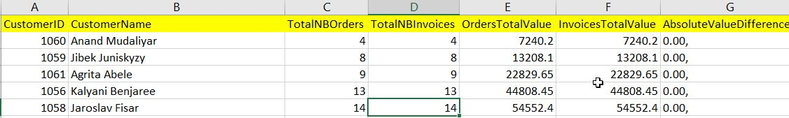
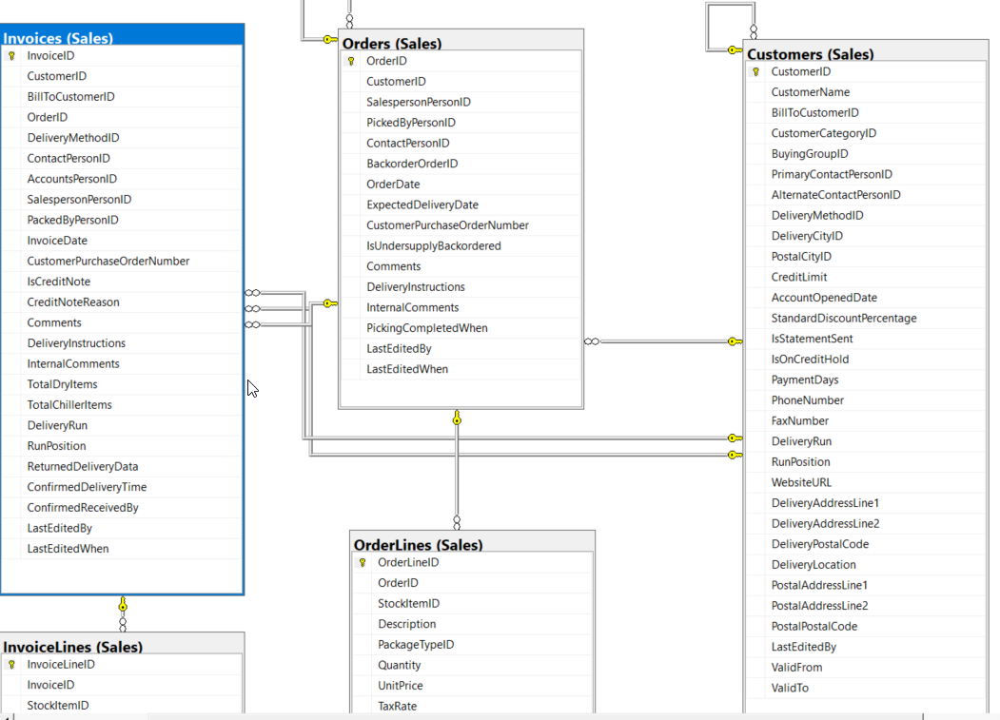
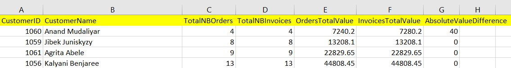
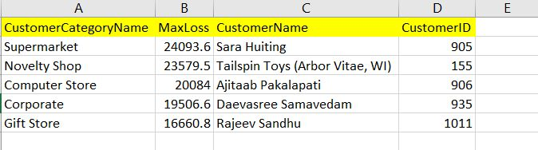

# **complex SQL queries**

The SQL queries below are some examples of complex SQL queries mainly on the sample Microsoft database [Wide World Importers sample database](https://github.com/Microsoft/sql-server-samples/releases/tag/wide-world-importers-v1.0) and running on SQLServer.

## **What is the query which reports the consistency between orders and their attached invoices?**

The resultset should report for each (CustomerID, CustomerName)\
 a. the total number of orders: TotalNBOrders\
 b. the number of invoices converted from an order: TotalNBInvoices\
 c. the total value of orders: OrdersTotalValue\
 d. the total value of invoices: InvoicesTotalValue\
 f. the absolute value of the difference between c - d: AbsoluteValueDifference\
 \
 The resultset must be sorted by highest values of AbsoluteValueDifference, then by smallest to highest values of TotalNBOrders and CustomerName is that order.

Here is a screenshot of the expected resultset:



The tables involved in the query and their links are shown in the screenshot below:



The SQL query is listed below:

``` sql
USE WideWorldImporters;

SELECT

t.CustomerID,

t.CustomerName,

SUM(t.TotalNBOrders) as TotalNBOrders,

SUM(t.TotalNBInvoices) as TotalNBInvoices,

SUM(t.OrdersTotalValue) as OrdersTotalValue,

SUM(t.InvoicesTotalValue) as InvoicesTotalValue,

ABS(SUM(OrdersTotalValue) - SUM(InvoicesTotalValue)) as AbsoluteValueDifference

FROM

(

(

SELECT

Cu.CustomerID,

Cu.CustomerName,

COALESCE(COUNT(DISTINCT O.OrderId),0) AS TotalNBOrders,

0 AS TotalNBInvoices,

COALESCE(SUM(OL.Quantity * OL.UnitPrice),0) as OrdersTotalValue,

0 as InvoicesTotalValue,

0 as AbsoluteValueDifference


FROM Sales.Customers as Cu,

Sales.Orders as O,

Sales.OrderLines as OL


WHERE

O.CustomerId = Cu.CustomerID

AND OL.OrderID = O.OrderID

AND EXISTS

(

SELECT *

FROM Sales.Invoices AS IP1

WHERE

IP1.OrderID = O.OrderID


)

GROUP BY

Cu.CustomerID,

Cu.CustomerName

)

UNION 

(

SELECT

Cu.CustomerID,

Cu.CustomerName,

0 AS TotalNBOrders,

COALESCE(COUNT(DISTINCT I.InvoiceID),0) AS TotalNBInvoices,

0 as OrdersTotalValue,

COALESCE(SUM(IL.Quantity * IL.UnitPrice),0) as InvoicesTotalValue,

0 as AbsoluteValueDifference


FROM Sales.Customers as Cu,

Sales.Invoices as I,

Sales.InvoiceLines as IL


WHERE

I.CustomerId = Cu.CustomerID

AND IL.InvoiceID = I.InvoiceID

AND EXISTS

(

SELECT *

FROM Sales.Orders AS OP2

WHERE

OP2.OrderID = I.OrderID


)


GROUP BY

Cu.CustomerID,

Cu.CustomerName

)

) as t


GROUP BY

CustomerID,

CustomerName


ORDER BY

AbsoluteValueDifference DESC,

TotalNBOrders,

CustomerName;
```

## **Update a specific UnitPrice of a product**

For the CustomerId = 1060 (CustomerName = ‘Anand Mudaliyar’)\
Identify the first InvoiceLine of his first Invoice, where “first” means the lowest respective IDs, and write an update query increasing the UnitPrice of this InvoiceLine by 20.

A screenshot of the expected resultset after the update query is shown below:



The SQL query is listed below:

``` sql
USE WideWorldImporters;


UPDATE Sales.InvoiceLines

SET UnitPrice = UnitPrice + 20

WHERE InvoiceId = 69627 AND InvoiceLineID = 225394 ;


SELECT

t.CustomerID,

t.CustomerName,

SUM(t.TotalNBOrders) as TotalNBOrders,

SUM(t.TotalNBInvoices) as TotalNBInvoices,

SUM(t.OrdersTotalValue) as OrdersTotalValue,

SUM(t.InvoicesTotalValue) as InvoicesTotalValue,

ABS(SUM(OrdersTotalValue) - SUM(InvoicesTotalValue)) as AbsoluteValueDifference

FROM

(

(

SELECT

Cu.CustomerID,

Cu.CustomerName,

COALESCE(COUNT(DISTINCT O.OrderId),0) AS TotalNBOrders,

0 AS TotalNBInvoices,

COALESCE(SUM(OL.Quantity * OL.UnitPrice),0) as OrdersTotalValue,

0 as InvoicesTotalValue,

0 as AbsoluteValueDifference


FROM Sales.Customers as Cu,

Sales.Orders as O,

Sales.OrderLines as OL


WHERE

O.CustomerId = Cu.CustomerID

AND OL.OrderID = O.OrderID

AND EXISTS

(

SELECT *

FROM Sales.Invoices AS IP1

WHERE

IP1.OrderID = O.OrderID


)

GROUP BY

Cu.CustomerID,

Cu.CustomerName

)

UNION 

(

SELECT

Cu.CustomerID,

Cu.CustomerName,

0 AS TotalNBOrders,

COALESCE(COUNT(DISTINCT I.InvoiceID),0) AS TotalNBInvoices,

0 as OrdersTotalValue,

COALESCE(SUM(IL.Quantity * IL.UnitPrice),0) as InvoicesTotalValue,

0 as AbsoluteValueDifference


FROM Sales.Customers as Cu,

Sales.Invoices as I,

Sales.InvoiceLines as IL


WHERE

I.CustomerId = Cu.CustomerID

AND IL.InvoiceID = I.InvoiceID

AND EXISTS

(

SELECT *

FROM Sales.Orders AS OP2

WHERE

OP2.OrderID = I.OrderID


)


GROUP BY

Cu.CustomerID,

Cu.CustomerName

)

) as t


GROUP BY

CustomerID,

CustomerName


ORDER BY

AbsoluteValueDifference DESC,

TotalNBOrders,

CustomerName;


-- Q2 ALTERNATIVE


USE WideWorldImporters;


UPDATE Sales.InvoiceLines

SET UnitPrice = UnitPrice + 20

WHERE InvoiceId = 69627 AND InvoiceLineID = 225394


SELECT Cu.CustomerID, Cu.CustomerName, SUM(IL.Quantity * IL.UnitPrice) as InvoiceTotal

FROM Sales.Customers as Cu,

Sales.Invoices as I,

Sales.InvoiceLines as IL

WHERE

Cu.CustomerId = 1060

AND I.InvoiceID = 69627

AND I.CustomerID = Cu.CustomerId

AND IL.InvoiceID = I.InvoiceID

GROUP BY

Cu.CustomerID, Cu.CustomerName;
```

## **Create a T-SQL stored procedure to report customer’s turnover**

Here are the specifications of this stored procedure: Using the database WideWorldImporters, write a T-SQL stored procedure called ReportCustomerTurnover.\
This procedure takes two parameters: Choice and Year, both integers.

When Choice = 1 and Year = , ReportCustomerTurnover selects all the customer names and their total monthly turnover (invoiced value) for the year .

When Choice = 2 and Year = , ReportCustomerTurnover selects all the customer names and their total quarterly (3 months) turnover (invoiced value) for the year .

When Choice = 3, the value of Year is ignored and ReportCustomerTurnover selects all the customer names and their total yearly turnover (invoiced value).

When no value is provided for the parameter Choice, the default value of Choice must be 1.\
When no value is provided for the parameter Year, the default value is 2013. This doesn’t impact Choice = 3.

For Choice = 3, the years can be hard-coded within the range of \[2013-2016\].

NULL values in the resultsets are not acceptable and must be substituted to 0.

All output resultsets are ordered by customer names alphabetically.

Here’s the code of the stored procedure:

``` sql
CREATE OR ALTER  PROCEDURE [dbo].[ReportCustomerTurnover](@Choice int = 1, @Year int = 2013)

AS

BEGIN


SET NOCOUNT ON;


IF (@Choice = 1)

BEGIN

SELECT C.CustomerName,

(

SELECT COALESCE(SUM(IL.UnitPrice*IL.Quantity), 0)

FROM Sales.InvoiceLines as IL, Sales.Invoices as I

WHERE IL.InvoiceID = I.InvoiceID 

AND C.CustomerID = I.CustomerID

AND MONTH(I.InvoiceDate) = 1 

AND YEAR(I.InvoiceDate) = @Year ) as 'Jan',

(

SELECT COALESCE(SUM(IL.UnitPrice*IL.Quantity), 0)

FROM Sales.InvoiceLines as IL, Sales.Invoices as I

WHERE IL.InvoiceID = I.InvoiceID 

AND C.CustomerID = I.CustomerID

AND  MONTH(I.InvoiceDate) = 2 

AND YEAR(I.InvoiceDate) = @Year ) as 'Feb',

(

SELECT COALESCE(SUM(IL.UnitPrice*IL.Quantity), 0)

FROM Sales.InvoiceLines as IL, Sales.Invoices as I

WHERE IL.InvoiceID = I.InvoiceID 

AND C.CustomerID = I.CustomerID

AND  MONTH(I.InvoiceDate) = 3 

AND YEAR(I.InvoiceDate) = @Year ) as 'Mar',

(

SELECT COALESCE(SUM(IL.UnitPrice*IL.Quantity), 0)

FROM Sales.InvoiceLines as IL, Sales.Invoices as I

WHERE IL.InvoiceID = I.InvoiceID 

AND C.CustomerID = I.CustomerID

AND MONTH(I.InvoiceDate) = 4 

AND YEAR(I.InvoiceDate) = @Year ) as 'Apr',

(

SELECT COALESCE(SUM(IL.UnitPrice*IL.Quantity), 0)

FROM Sales.InvoiceLines as IL, Sales.Invoices as I

WHERE IL.InvoiceID = I.InvoiceID 

AND C.CustomerID = I.CustomerID

AND MONTH(I.InvoiceDate) = 5 

AND YEAR(I.InvoiceDate) = @Year ) as 'May',

(

SELECT COALESCE(SUM(IL.UnitPrice*IL.Quantity), 0)

FROM Sales.InvoiceLines as IL, Sales.Invoices as I

WHERE IL.InvoiceID = I.InvoiceID 

AND C.CustomerID = I.CustomerID

AND MONTH(I.InvoiceDate) = 6 

AND YEAR(I.InvoiceDate) = @Year ) as 'Jun',

(

SELECT COALESCE(SUM(IL.UnitPrice*IL.Quantity), 0)

FROM Sales.InvoiceLines as IL, Sales.Invoices as I

WHERE IL.InvoiceID = I.InvoiceID 

AND C.CustomerID = I.CustomerID

AND MONTH(I.InvoiceDate) = 7 

AND YEAR(I.InvoiceDate) = @Year ) as 'Jul',

(

SELECT COALESCE(SUM(IL.UnitPrice*IL.Quantity), 0)

FROM Sales.InvoiceLines as IL, Sales.Invoices as I

WHERE IL.InvoiceID = I.InvoiceID 

AND C.CustomerID = I.CustomerID

AND MONTH(I.InvoiceDate) = 8 

AND YEAR(I.InvoiceDate) = @Year ) as 'Aug',

(

SELECT COALESCE(SUM(IL.UnitPrice*IL.Quantity), 0)

FROM Sales.InvoiceLines as IL, Sales.Invoices as I

WHERE IL.InvoiceID = I.InvoiceID 

AND C.CustomerID = I.CustomerID

AND MONTH(I.InvoiceDate) = 9 

AND YEAR(I.InvoiceDate) = @Year ) as 'Sep',

(

SELECT COALESCE(SUM(IL.UnitPrice*IL.Quantity), 0)

FROM Sales.InvoiceLines as IL, Sales.Invoices as I

WHERE IL.InvoiceID = I.InvoiceID 

AND C.CustomerID = I.CustomerID

AND MONTH(I.InvoiceDate) = 10 

AND YEAR(I.InvoiceDate) = @Year ) as 'Oct',

(

SELECT COALESCE(SUM(IL.UnitPrice*IL.Quantity), 0)

FROM Sales.InvoiceLines as IL, Sales.Invoices as I

WHERE IL.InvoiceID = I.InvoiceID 

AND C.CustomerID = I.CustomerID

AND MONTH(I.InvoiceDate)= 11 

AND YEAR(I.InvoiceDate) = @Year ) as 'Nov',

(

SELECT COALESCE(SUM(IL.UnitPrice*IL.Quantity), 0)

FROM Sales.InvoiceLines as IL, Sales.Invoices as I

WHERE IL.InvoiceID = I.InvoiceID 

AND C.CustomerID = I.CustomerID

AND MONTH(I.InvoiceDate) = 12 

AND YEAR(I.InvoiceDate) = @Year ) as 'Dec'

FROM Sales.Customers as C

ORDER BY C.CustomerName

END


IF (@Choice = 2)

BEGIN 

SELECT C.CustomerName,

(

SELECT COALESCE(SUM(IL.UnitPrice*IL.Quantity), 0)

FROM Sales.InvoiceLines as IL, Sales.Invoices as I

WHERE IL.InvoiceID = I.InvoiceID 

AND C.CustomerID = I.CustomerID

AND YEAR(I.InvoiceDate) = @Year

AND DATEPART(QUARTER, I.InvoiceDate) = 1 ) as 'Q1',

(

SELECT COALESCE(SUM(IL.UnitPrice*IL.Quantity), 0)

FROM Sales.InvoiceLines as IL, Sales.Invoices as I

WHERE IL.InvoiceID = I.InvoiceID 

AND C.CustomerID = I.CustomerID

AND YEAR(I.InvoiceDate) = @Year

AND DATEPART(QUARTER, I.InvoiceDate) = 2 ) as 'Q2',

(

SELECT COALESCE(SUM(IL.UnitPrice*IL.Quantity), 0)

FROM Sales.InvoiceLines as IL, Sales.Invoices as I

WHERE IL.InvoiceID = I.InvoiceID 

AND C.CustomerID = I.CustomerID

AND YEAR(I.InvoiceDate) = @Year

AND DATEPART(QUARTER, I.InvoiceDate) = 3 ) as 'Q3',

(

SELECT COALESCE(SUM(IL.UnitPrice*IL.Quantity), 0)

FROM Sales.InvoiceLines as IL, Sales.Invoices as I

WHERE IL.InvoiceID = I.InvoiceID 

AND C.CustomerID = I.CustomerID

AND YEAR(I.InvoiceDate) = @Year

AND DATEPART(QUARTER, I.InvoiceDate) = 4 ) as 'Q4'

FROM Sales.Customers as C

ORDER BY C.CustomerName

END


IF (@Choice = 3)

BEGIN

SELECT CustomerName,

(

SELECT COALESCE(SUM(IL.UnitPrice*IL.Quantity), 0)

FROM

Sales.InvoiceLines as IL,

Sales.Invoices as I

WHERE

IL.InvoiceID = I.InvoiceID 

AND Cu.CustomerID = I.CustomerID

AND YEAR(I.InvoiceDate) = 2013

) As '2013',

(

SELECT COALESCE(SUM(IL.UnitPrice*IL.Quantity), 0)

FROM

Sales.InvoiceLines as IL,

Sales.Invoices as I

WHERE

IL.InvoiceID = I.InvoiceID 

AND Cu.CustomerID = I.CustomerID

AND YEAR(I.InvoiceDate) = 2014

) As '2014',

(

SELECT COALESCE(SUM(IL.UnitPrice*IL.Quantity), 0)

FROM

Sales.InvoiceLines as IL,

Sales.Invoices as I

WHERE

IL.InvoiceID = I.InvoiceID 

AND Cu.CustomerID = I.CustomerID

AND YEAR(I.InvoiceDate) = 2015

) As '2015',

(

SELECT COALESCE(SUM(IL.UnitPrice*IL.Quantity), 0)

FROM

Sales.InvoiceLines as IL,

Sales.Invoices as I

WHERE

IL.InvoiceID = I.InvoiceID 

AND Cu.CustomerID = I.CustomerID

AND YEAR(I.InvoiceDate) = 2016

) As '2016'

FROM

Sales.Customers as Cu

ORDER By CustomerName


END


END
```

## **How to write a SQL query which reports the highest loss of money from orders not being converted into invoices?**

In the database WideWorldImporters, write a SQL query which reports the highest loss of money from orders not being converted into invoices, by customer category. The name and id of the customer who generated this highest loss must also be identified. The resultset is ordered by highest loss.

A screenshot of the expected resultset after the update query shown below:



The SQL query is listed below:

``` sql
USE WideWorldImporters;

  

  SELECT

WorstLoses.CustomerCategoryName,

WorstLoses.MaxLoss,

Sub2AllTotals.CustomerName,

Sub2AllTotals.CustomerID

  FROM

  (

  SELECT    Sub1AllTotals.CustomerCategoryName,

MAX(Sub1AllTotals.TotalValueLostOrders) as MaxLoss

  FROM 

  (

  SELECT Cu.CustomerID,

Cu.CustomerName,

Ca.CustomerCategoryName,

SUM(OL.Quantity * OL.UnitPrice) as TotalValueLostOrders


  FROM Sales.Orders as O,

Sales.OrderLines as OL,

Sales.Customers as Cu,

Sales.CustomerCategories as Ca

  WHERE NOT EXISTS

  (

SELECT *

FROM Sales.Invoices as I

WHERE I.OrderID = O.OrderID

  )

  AND OL.OrderId = O.OrderId

  AND Cu.CustomerID = O.CustomerID

  AND Ca.CustomerCategoryID = Cu.CustomerCategoryID


GROUP BY Cu.CustomerID, Cu.CustomerName, Ca.CustomerCategoryName

) as Sub1AllTotals


GROUP BY CustomerCategoryName

) as WorstLoses,

(

SELECT Cu.CustomerID,

Cu.CustomerName,

Ca.CustomerCategoryName,

SUM(OL.Quantity * OL.UnitPrice) as TotalValueLostOrders


  FROM Sales.Orders as O,

Sales.OrderLines as OL,

Sales.Customers as Cu,

Sales.CustomerCategories as Ca

  WHERE NOT EXISTS

  (

SELECT *

FROM Sales.Invoices as I

WHERE I.OrderID = O.OrderID

  )

  AND OL.OrderId = O.OrderId

  AND Cu.CustomerID = O.CustomerID

  AND Ca.CustomerCategoryID = Cu.CustomerCategoryID


GROUP BY Cu.CustomerID, Cu.CustomerName, Ca.CustomerCategoryName

) as Sub2AllTotals


WHERE

WorstLoses.CustomerCategoryName = Sub2AllTotals.CustomerCategoryName

AND WorstLoses.MaxLoss = Sub2AllTotals.TotalValueLostOrders


ORDER BY

WorstLoses.MaxLoss DESC
```

## **How to write a division query?**

SQLPlayground is a sample database with 3 tables Customer, Product and purchase. In the database SQLPlayground, write a SQL query selecting all the customers’ data who have purchased all the products AND have bought more than 50 products in total (sum of all purchases).

The SQL query is listed below:

``` sql
USE SQLPlayground;

SELECT *
FROM    Customer as Cu
WHERE NOT EXISTS
(
    SELECT *
    FROM Product as P
    WHERE NOT EXISTS
    (
        SELECT *
        FROM Purchase as Pu
        WHERE
            Pu.ProductId = P.ProductId
            AND Cu.CustomerId = Pu.CustomerId
    )
)
AND (
        SELECT SUM(Pu2.Qty)
        FROM Purchase as Pu2
        WHERE
            Pu2.CustomerId = Cu.CustomerId
    ) >= 50
```
